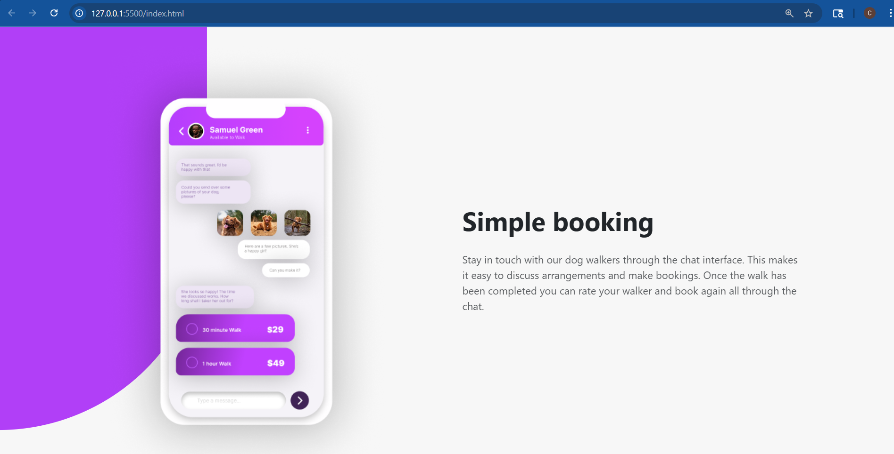
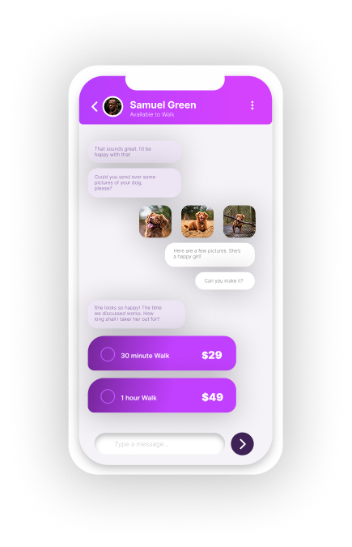

Frontend Mentor | Chat App CSS Illustration

Overview
A responsive landing page featuring a chat app mockup and descriptive text, built using Bootstrap 5.

The Challenge
Build the provided design using HTML, CSS, and Bootstrap.
Ensure the layout is responsive across different devices.
Screenshot

My Process
Built with
Semantic HTML5
Bootstrap 5.3 (Grid, Flexbox utilities)
Custom CSS for positioning (position: fixed, transform)
Figma (for design inspiration and asset export)

Asset Creation
The main "phone" asset was exported as a .png file directly from the Figma design file provided in the challenge.

What I Learned
Managing stacking order (z-index) and keeping elements fixed (position: fixed) while the content scrolls over them was a key learning point in this project.

Author
GitHub - @cfra8189